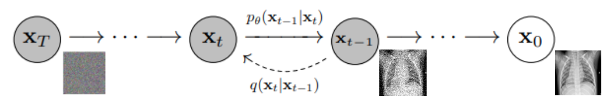

# chest-x-ray-ddpm

Implementation of [Denoising Diffusion Probabilistic Model](https://arxiv.org/abs/2006.11239) [1] for chest X-ray image generation. \
The dataset used for this project is an open dataset [2] and is available publicly on [Kaggle](https://www.kaggle.com/datasets/francismon/curated-covid19-chest-xray-dataset).





This implementation is derived from the following Pytorch implementation [GitHub](https://github.com/lucidrains/denoising-diffusion-pytorch)

## Denoising Diffusion Probabilistic Model 


## Install 

### Library requirements

- Pyenv 2.3.9
- Python 3.10.5    
- Poetry 1.5.1


#### Install Pyenv

```bash
curl https://pyenv.run | bash
```

Then, add pyenv bin directory in your shell configuration file `~/.bashrc` or `~/.zshrc`

```bash
export PATH="$HOME/.pyenv/bin:$PATH"
eval "$(pyenv init -)"
eval "$(pyenv virtualenv-init -)
```

Finally reload you shell 
```bash
source ~/.bashrc
```

#### Install Poetry


```bash
curl -sSL https://install.python-poetry.org | python3 -
```

Then, add poetry's bin directory in your shell configuration file `~/.bashrc` or `~/.zshrc`

```bash
export PATH="/home/ubuntu/.local/bin:$PATH"
```

Finally reload you shell 
```bash
source ~/.bashrc
```
or if you are using zsh 
```bash
source ~/.zshrc
```

## Training

```python
from src.models.denoising_diffusion import GaussianDiffusion
from src.models.unet import Unet
from src.training.trainer import Trainer


model = Unet(
    dim = 64,
    dim_mults = (1, 2, 4, 8),
    flash_attn = True
)

diffusion = GaussianDiffusion(
    model,
    image_size = 128,
    timesteps = 1000,           # number of steps
    sampling_timesteps = 250    # number of sampling timesteps (using ddim for faster inference [see citation for ddim paper])
)

trainer = Trainer(
    diffusion,
    'path/to/your/images',
    train_batch_size = 32,
    train_lr = 8e-5,
    train_num_steps = 700000,         # total training steps
    gradient_accumulate_every = 2,    # gradient accumulation steps
    ema_decay = 0.995,                # exponential moving average decay
    amp = True,                       # turn on mixed precision
    calculate_fid = True              # whether to calculate fid during training
)

trainer.train()
```

You can also use the command line using argparse \

```bash
poetry run python src/training/train.py 
```

## Citations

[1] Denoising Diffusion Probabilistic Model, Ho et al. (2020) \
[2] Curated Dataset for COVID-19 Posterior-Anterior Chest Radiography Images (X-Rays), Sait et al. (2020)